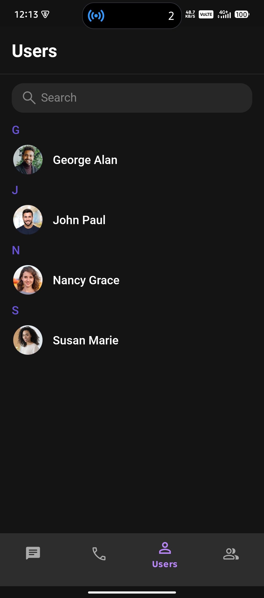

# CometChat UI Kit Integration (Java - Android)

This project demonstrates the integration of CometChat's Android Java UI Kit using fragments and bottom navigation.

## 📱 Features
- User Login with UID
- Chat Screen with Conversations
- Group Chat
- Call Logs
- Custom UI Fragments with Navigation

## 🔧 Tech Stack
- Java
- Android SDK 30+
- CometChat UI Kit v3.0.0

## 🛠️ Issues Faced & Solutions
### 1. Chat Layout Not Fitting
- Fixed with `adjustResize` in `AndroidManifest.xml` and layout insets.

### 2. Chat Not Opening on Click
- Handled manually via `setOnItemClickListener` and launched MessageActivity with UID.

## 🧑‍💻 User IDs Used
- cometchat-uid-1
- cometchat-uid-2
- cometchat-uid-3
- cometchat-uid-4
- cometchat-uid-5

## 📸 Screenshots

### 🧵 Chat Screen

### 💬 Conversation Screen

### 👥 Group Chat Screen

### 📞 Call Logs

### 👤 User List

## 📂 How to Run
- Clone the repo
- Add your `APP_ID`, `REGION`, and `AUTH_KEY` from CometChat
- Build and run in Android Studio
